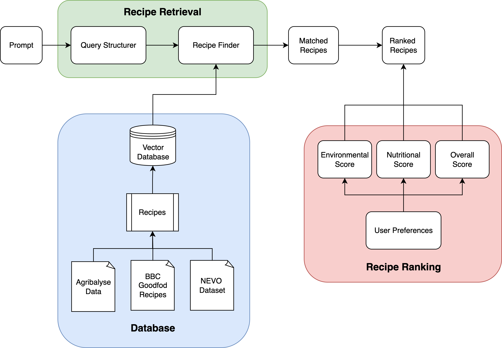

# 🌱 Towards Sustainable Food Recommendations  
**Integrating Nutritional and Environmental Metrics**

[](https://www.python.org/)
[](https://streamlit.io/)
[](#)

---

This prototype is a **Streamlit web application** connected with the [Langflow](https://www.langflow.org/) API (via [DataStax AstraDB](https://www.datastax.com/astra/db)) to make recipe recommendations for users.  
It contains ~5600 recipes and integrates **nutritional and environmental metrics** to support sustainable food choices.

This project was designed as part of my **Master Thesis at the [University of Twente](https://www.utwente.nl/)** in **Business Information Technology**.

A user study was conducted to evaluate the system, and it received **positive feedback**, with several improvement suggestions noted.  
For more details, please refer to the **full thesis** included in this repository.

📧 For further inquiries: [eric.wan0409@gmail.com](mailto:eric.wan0409@gmail.com)

---

## ✨ Key Features

- 🍲 Recipe retrieval with semantic search (Langflow + AstraDB)
- ⚖️ Health/Environment scoring model
- ⚙️ Adjustable weighting between all metrics
- 📊 Transparent score breakdown (nutrition, environment, and calculation views)

---

## 🧩 High-Level Architecture

<!-- Replace the path below with the actual image path in your repo -->


---

## 📚 Data Sources

- [Agribalyse](https://agribalyse.ademe.fr/) — Environmental metrics  
- [NEVO](https://nevo-online.rivm.nl/) — Nutritional metrics  
- [BBC Good Food](https://www.bbcgoodfood.com/) — Recipe dataset  

---

## ⚙️ Installation

1. Use **Python 3.10.13** (recommended — other versions not tested)
2. Install dependencies:

   ```bash
   pip install -r requirements.txt
3. Run the application locally:
   ```bash
   streamlit run "👋 Welcome.py" --server.headless True
4. To use the Langflow recipe retrieval component, please contact me to get the API credentials.

## 🚀 Usage
1. After installation, launch the app and follow the guided pages.
2. The landing page was designed for the user study survey but can also be used as a normal entry point.
3. Proceed through the pages in order (top to bottom).
4. After completing the setup, you can search for recipes — the system will display multiple recommended options, and you can click on them to see full details.

## 📩 Contact
If you have questions, suggestions, or want to collaborate, feel free to reach out:
eric.wan0409@gmail.com
